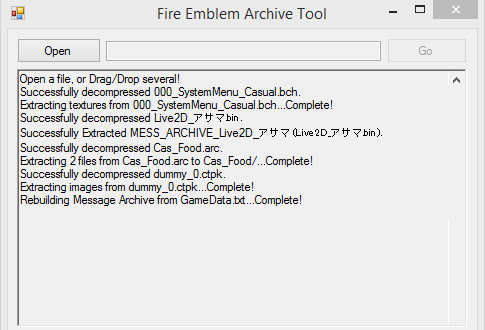
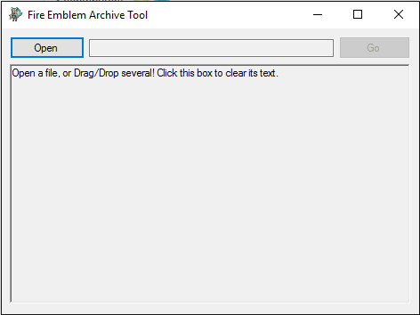

# FEAT

Fire Emblem Archive Tool (A tool to automatically extract data from 3DS Fire Emblem archives)

Credit to [ctpktool](https://github.com/polaris-/ctpktool) and [DSDecmp](https://github.com/einstein95/dsdecmp), from which code is used for ctpk unpacking and LZ decompression, respectively. 

Forked v1.1:

- Removed prompt to rebuild text files.

- Updated cptktool files so it would work instead of crashing and doing nothing.

- Added a program icon.

Forked v1.2:

- Removed check that made certain Fates models crash. It would make sure the first four bytes of the input file were valid, but the value was different on certain Fates models and failed. There's no reason to have this check, as the program doesn't actually do anything if input the file actually IS invalid.

- Reformatted README.md to be easier to read.

- Embedded pictures instead of using Imgur for hosting.

